<div align="center">
  

  <br />

  *Every system is just a question that learned how to run.*

  <a href="mailto:sarthakbhandari172@gmail.com">Email</a> ·
  <a href="https://github.com/sarthakbhandari172-blip?tab=repositories">Projects</a>
</div>

---

### About me

```text
name     → Sarthak Bhandari
country  → Nepal 🇳🇵
into     → technology, creative coding, and new ideas
style    → learn fast · build clean · keep evolving
```

### The toolkit


<sub>Profile designed as code: lightweight, responsive, and animated with pure SVG.</sub>
